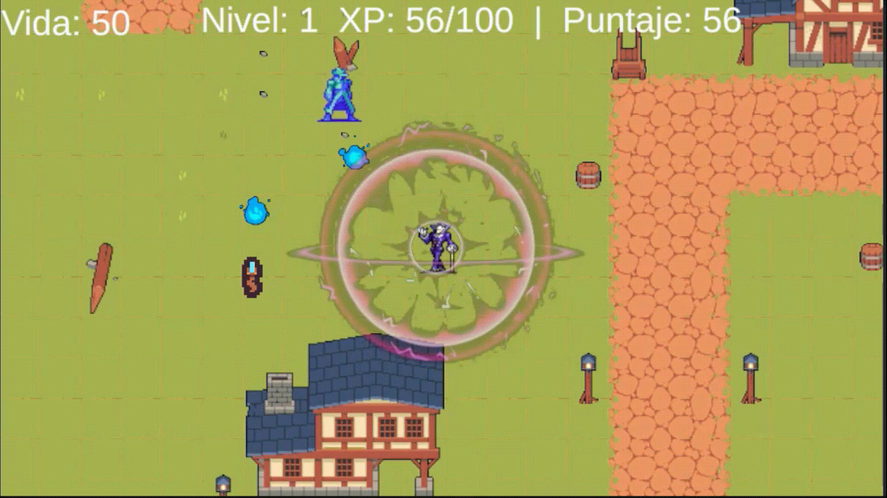
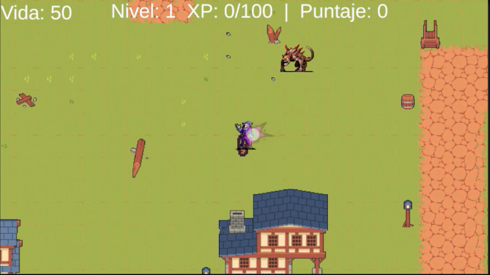

# 🎮 ¡Actividades de las Semanas 3, 4, 5 y 6!

¡Hola! 👋 En este repositorio podrás encontrar el trabajo que realicé para las actividades de las semanas 3 a la 6.

## 🌿 Navegación por Ramas (Branches)

¿Deseas ver cuál fue mi progreso en cada semana? ¡Es muy fácil!
- **Semana 3:** Cambia a la rama `DesarrolloS3`.
- **Semana 4:** Cambia a la rama `AvancesS4`.
- **Semana 5:** Cambia a la rama `DesarrolloS5`.
- **Semana 6:** Mantente en la rama `DesarrolloS6` (esta es la rama por defecto).
---

## ✨ Características Destacadas

### 🕹️ Control del Player
El sistema del jugador está dividido en dos partes principales:
1. Los controles de movimiento del personaje.
2. El sistema que representa su vida y el recolector de ítems.

**💡 Mecánica de control:**
- Presiona **`Shift Izquierdo`** para que el personaje se detenga.
- Presiona **`Control Izquierdo`** para que el recolector/vida se detenga de forma independiente.

### 🎬 Demostración Visual
> *A continuación, un vistazo a las mecánicas en acción:*

  <table>
    <tr>
      <td align="center"><b><code>Shift Izquierdo</code></b></td>
      <td align="center"><b><code>Control Izquierdo</code></b></td>
    </tr>
    <tr>
      <td align="center"></td>
      <td align="center"></td>
    </tr>
  </table>

---

## 📜 ¿Qué hay de los Scripts?

Para hacer que todo esto funcione, se crearon un total de **16 scripts**. En fin :D, aquí te comparto las implementaciones técnicas nuevas que más me gustaron:

* 🗂️ **Organización en el Inspector:** Implementé el atributo `[Header("Titulo")]` para crear encabezados y ordenar de manera elegante nuestros valores en el Inspector de Unity.
* 🟢 **Gizmos:** Uso del método `OnDrawGizmosSelected()` para dibujar y visualizar el radio de colisión del `Colector` directamente en la escena.
* 🧮 **Cálculos Matemáticos:** Uso de métodos de la clase `Mathf` para definir límites, realizar redondeos y aplicar valores infinitos negativos para asegurar que nuestros métodos se activen correctamente con cualquier valor superior.
* 🖥️ **Interfaz de Usuario (UI):** Uso de componentes `TextMeshProUGUI` para mostrar la vida, experiencia (XP) y el puntaje (Score) del Player en pantalla, recolectando estos datos de forma limpia desde el `BaseData` del Player.

> ¡Hay más implementaciones que son muy interesantes, pero estas son las que más disfruté investigar e incluir en el proyecto! :D

